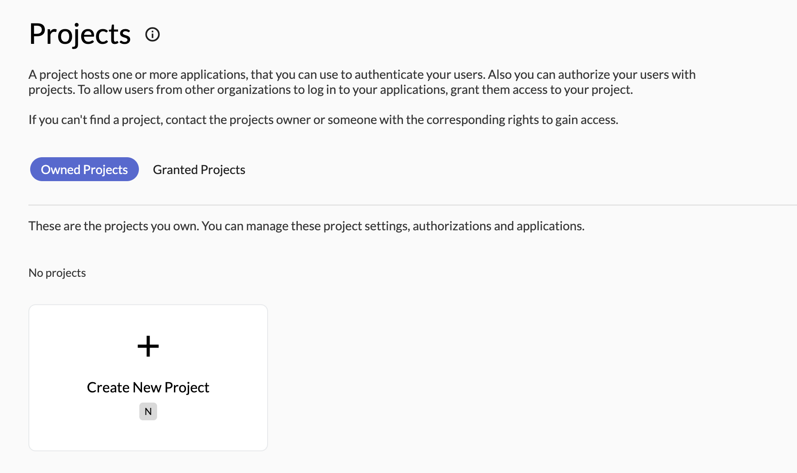
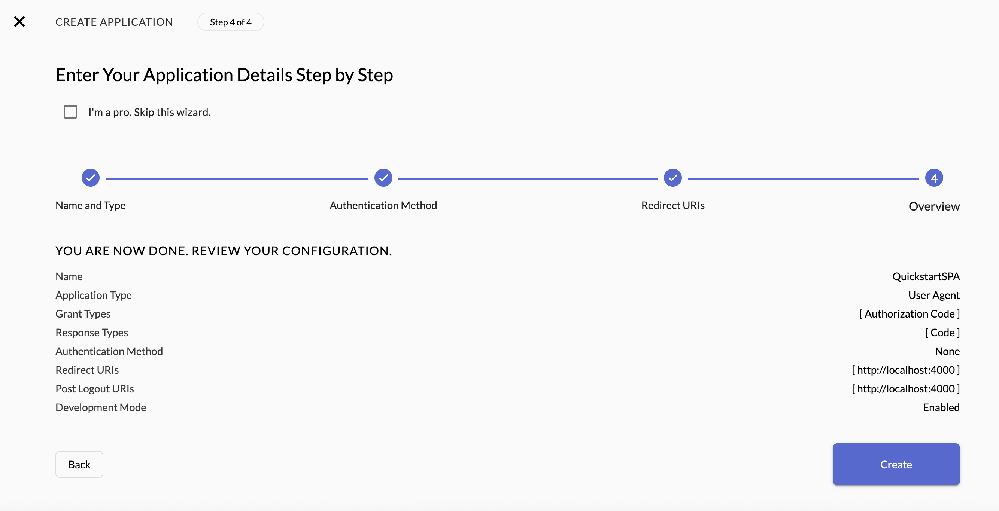
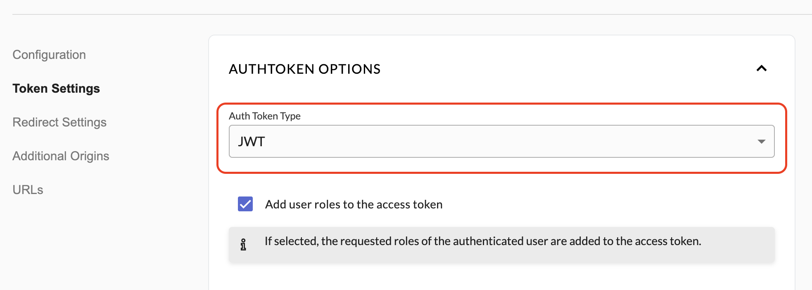

# @zitadel/react Quickstart SPA
<p align="center">
    
</p>

Authenticate your [ZITADEL](https://zitadel.com) users within your React applications.

> [!IMPORTANT]
> If you want to try out [@zitadel/react](https://www.npmjs.com/package/@zitadel/react), read the [ZITADEL step-by-step guide for React](https://zitadel.com/docs/examples/login/react).
> It shows how to get the _authority_ and _client_id_ from ZITADEL and how to wire everything up in React.

## Project Structure

This project is a default React application created with [Create React App](https://create-react-app.dev/) that contains the ZITADEL React SDK to handle OIDC. The library is located in `/lib` folder and published as `@zitadel/react`.


[](https://makeapullrequest.com)

The following pages are added to the scaffolded example application:

- _src/components/Login.tsx_: The login page shows a button if no user is authenticated and redirects the user to /callback if authenticated.
- _src/components/Callback.tsx_: This page completes the auth flow and renders the retrieved information from the user info endpoint.

## Available scripts

### `yarn start`

Runs the app in the development mode.\
Open [http://localhost:3000](http://localhost:3000) to view it in the browser.

The page will reload if you make edits.\
You will also see any lint errors in the console.

### `yarn build`

Builds the app for production to the `build` folder.\
It correctly bundles React in production mode and optimizes the build for the best performance.

The build is minified and the filenames include the hashes.\
Your app is ready to be deployed!

See the section about [deployment](https://facebook.github.io/create-react-app/docs/deployment) for more information.

## Learn More

You can learn more in the [Create React App documentation](https://facebook.github.io/create-react-app/docs/getting-started).

To learn React, check out the [React documentation](https://reactjs.org/).

## Setup Instructions

1. **Log into the Zitadel Customer Portal**  
   Go to the [Zitadel Customer Portal](https://zitadel.com/admin/dashboard)

2. **Create an Instance**  
   - Choose a region and create your new instance.

3. **Create a Project**  
   - Inside your instance, go to Projects -> Create New Project



4. **Create an Application**  
   - New **"User Agent"**
   - Select **"PKCE"**
   - Enable **"Development Mode"**
   - Configure your **Redirect URI** and **Post Logout URI** (`http://localhost:3000` for local testing)
   - Click **"Continue"** and **"Create"**
   - Copy the **"Client ID"**



5. **Change your token type to `JWT` in your application settings**  



6. **Configure `ZitadelConfig`**  
Open `src/App.tsx` and replace the placeholder for *authority* and *client_id* values with your application info:

```js
const config: ZitadelConfig = {
    authority: "https://CUSTOM_DOMAIN",
    client_id: "YOUR_CLIENT_ID",
    redirect_uri: "http://localhost:3000/callback",
    post_logout_redirect_uri: "http://localhost:3000",
    response_type: 'code',
    scope: 'openid profile email'
};
```

7. **Run the application**

To run the example, navigate to the `/lib` folder and run `yarn build`.

```bash
cd ./lib
yarn install
yarn build
```

Then, navigate back and install the dependencies

```bash
cd ..
yarn install
```

```bash
yarn start
```

Your application will then run on `http://localhost:3000`
